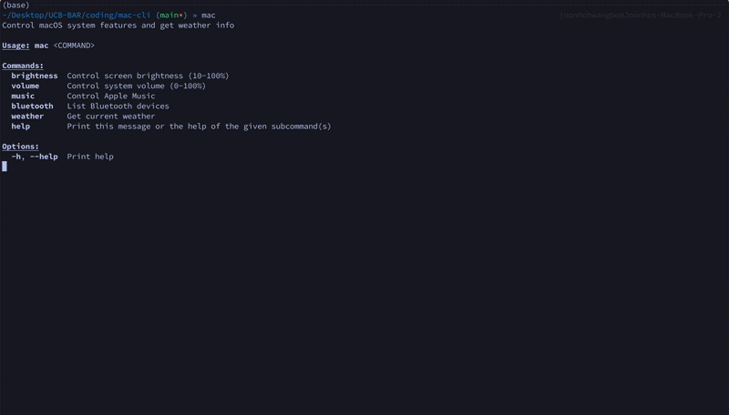

# mac-cli

A simple command-line tool to control your Mac from the terminal.



## Features

- Volume Control
- Brightness Control
- Apple Music: Control playback, navigate tracks, and manage playlists
- Bluetooth: List devices
- Weather: Get current weather for any location

## Installation

### From crates.io

```bash
cargo install mac-cli
```

### From source

```bash
git clone https://github.com/joonho3020/mac-cli.git
cd mac-cli
cargo install --path .
```

## Usage

The binary is called `mac`. Run `mac --help` to see all available commands.

### Brightness

```bash
# Get current brightness
mac brightness

# Set brightness to 50%
mac brightness 50
```

### Volume

```bash
# Get current volume
mac volume

# Set volume to 75%
mac volume 75
```

### Apple Music

Music control inspired by [appleMusic-cli-player](https://github.com/talz-a/appleMusic-cli-player).

```bash
mac music play
mac music pause
mac music next
mac music previous
mac music current
mac music playlists --list
mac music playlists "My Playlist"
mac music playlists
```

### Bluetooth

```bash
mac bluetooth
```

### Weather

```bash
mac weather
mac weather "San Francisco"
mac weather "London, UK"
```

## Requirements

- Rust 1.70+ (for building from source)
- `fzf` (optional, for interactive playlist selection)

## License

Licensed under the Apache License, Version 2.0. See [LICENSE](LICENSE) for details.
